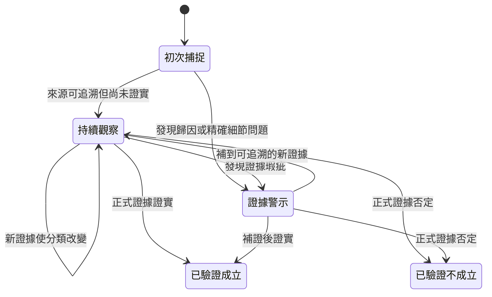

# 領先假說（市場小作文）研究方法

`notes/leading_hypotheses/` 保存市場流傳、尚未被正式一手文件完整覆蓋，但具體、可追溯且
可被後續事件驗證的主張。它是觀察層，不是正式質化筆記、事實認證、投資建議或評分因子。

## 收錄邊界

- 只為已有有效 `independently_verified` 正式筆記的股票建立報告。
- 每則假說保存首次捕捉日、來源層級、目前狀態、正式資料基準、可證偽條件與下次驗證。
- 報告 meta 必須錨定正式筆記的 `reviewed_content_sha256`；正式筆記更新後，lint 會要求重新對照。
- 搜尋結果、社群貼文、媒體與券商轉述都只能支持「市場正在流傳此主張」，不能自動證明主張為真。
- 多篇轉載同一場法說、股東會或券商報告只算同一原始訊息鏈，不以網頁數灌水可信度。
- 不保存整篇受著作權保護的文章，只記研究所需的主張摘要、定位與原始連結。

## 讀者狀態名稱

| 讀者名稱 | 內部代碼 | 階段 | 定義 |
|---|---|---|---|
| 管理層說法・待驗證 | `management_quoted` | 持續觀察 | 具名管理層談話或媒體轉述，尚未由正式文件或實績完成核對 |
| 方向相符・細節待證 | `consistent_unconfirmed` | 持續觀察 | 與正式資料方向一致，但關鍵客戶、數量、占比或時程仍未證實 |
| 合理線索・證據不足 | `plausible_lead` | 持續觀察 | 產業邏輯合理且有明確驗證點，目前仍缺公司層級證據 |
| 歸因錯置 | `attribution_error` | 證據警示 | 產業、客戶或供應鏈數字被錯誤歸因為公司本身 |
| 精確細節無法核實 | `unsupported_specificity` | 證據警示 | 客戶名、台數、單價、占比或時程過度精確，但原始依據不可追溯 |
| 已驗證不成立 | `contradicted` | 驗證終態 | 已被較強、較新的正式證據否定 |
| 已驗證成立 | `resolved` | 驗證終態 | 已被正式證據或可重算實績證實 |

「管理層說法・待驗證」不是「已獨立核驗」。管理層談話可能是方向、目標或估計，仍須等待財報、
重大訊息、法說附件或可重算營運結果。

## 狀態機



- 「持續觀察」包含管理層說法・待驗證、方向相符・細節待證、合理線索・證據不足。
- 「證據警示」包含歸因錯置、精確細節無法核實；它們不是終態，補到新證據後可回到持續觀察。
- 「已驗證成立／不成立」是終態。終態不刪除舊主張，而是保留首次捕捉日、驗證結果與日期。
- 股價上漲、下跌或轉載篇數都不能觸發狀態轉移；只有正式文件、可重算實績或明確事件里程碑可以。

## 固定格式與維護

每個 `## H#｜標題` 必須依序含有「市場主張、首次捕捉、來源層級、目前狀態、正式資料基準、
可證偽條件、下次驗證、研究判讀、來源」。建立或更新後執行：

```powershell
uv run --no-project --python 3.12 python scripts/leading_hypotheses.py --lint
uv run --no-project --python 3.12 python scripts/build_dashboard.py
uv run --no-project --python 3.12 python -m unittest discover -s tests
```

更新時不得用股價漲跌判定真偽；應使用假說事前寫下的公司揭露、季度營收／毛利、量產、驗收、
客戶或產能里程碑。失效的假說改標 `contradicted`，獲證實者改標 `resolved`，保留原始時間戳，
避免事後改寫研究紀錄。
