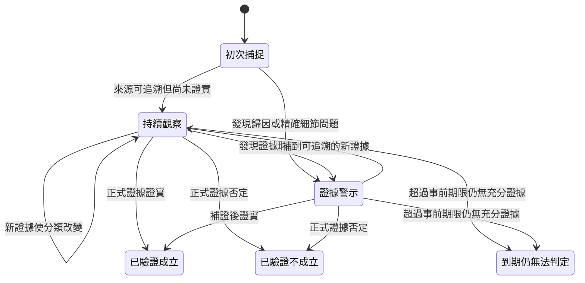

# 領先假說（市場小作文）研究方法

`notes/leading_hypotheses/` 保存市場流傳、尚未被正式一手文件完整覆蓋，但具體、可追溯且
可被後續事件驗證的主張。它是觀察層，不是正式質化筆記、事實認證、投資建議或評分因子。

第一階段的凍結樣本、可下結論、限制與第二階段決策見
[領先假說第一階段回顧](LEADING_HYPOTHESES_PHASE1_REVIEW.md)。
實際建立、複核、終態處理與成效檢視步驟見
[領先假說第二階段操作手冊](LEADING_HYPOTHESES_PHASE2_RUNBOOK.md)。

## 收錄邊界

- 只為已有有效 `independently_verified` 正式筆記的股票建立報告。
- 每則假說保存首次捕捉日、來源層級、目前狀態、正式資料基準、可證偽條件與下次驗證。
- 報告 meta 必須錨定正式筆記的 `reviewed_content_sha256`；正式筆記更新後，lint 會要求重新對照。
- 搜尋結果、社群貼文、媒體與券商轉述都只能支持「市場正在流傳此主張」，不能自動證明主張為真。
- 多篇轉載同一場法說、股東會或券商報告只算同一原始訊息鏈，不以網頁數灌水可信度。
- 不保存整篇受著作權保護的文章，只記研究所需的主張摘要、定位與原始連結。

## v2 時間與證據資料

`report_version: 2` 將讀者正文與機器稽核資料分開。每個 H# 下方的
`hypothesis_meta` 保存：

| 欄位 | 用途 |
|---|---|
| `source_published_at` | 原始消息或主張公開日期 |
| `research_captured_at` | 本研究實際收錄日期；不得事後回填成消息日期 |
| `capture_mode` | `prospective` 前瞻捕捉／`retrospective` 回溯基線 |
| `lifecycle` | `open`／`confirmed`／`refuted`／`expired_unresolved` |
| `evidence_strength` | `weak`／`medium`／`strong`，與生命週期分開 |
| `evidence_flags` | 歸因錯置、過度精確、匿名來源、僅有轉述等警示，可複選 |
| `source_type` | 公司、管理層、券商、媒體、匿名供應鏈、社群、自媒體或混合 |
| `source_publishers` | 來源 URL 的主機集合，由 lint 與正文連結交叉核對 |
| `source_accessed_at` | 建立假說時首次實際存取來源日期，須等於研究收錄日 |
| `source_chain_ids` | 獨立原始訊息鏈 ID；多篇轉載同一事件共用一條鏈 |
| `independent_chain_count` | 必須等於唯一訊息鏈 ID 數，不能用網址數灌水 |
| `review_due` | 單則假說的驗證期限；終態使用 `none` |

第一階段與覆蓋補齊合計 196 則全部標為 `retrospective`。回溯基線封存日固定為
2026-07-12，lint 不允許在此日期後新增回溯內容。只有系統在消息出現時實際收錄、且
`research_captured_at` 留下當時日期的新主張，才可標為 `prospective` 並計算資訊領先時間。

來源類型描述的是消息從哪裡來，不代表真假；管理層談話即使是直接來源，仍可能只是目標或展望。
證據強度也不由媒體家數、轉貼次數或股價反應決定。

## 讀者狀態名稱

| 讀者名稱 | 內部代碼 | 階段 | 定義 |
|---|---|---|---|
| 管理層說法・待驗證 | `management_quoted` | 持續觀察 | 具名管理層談話或媒體轉述，尚未由正式文件或實績完成核對 |
| 方向相符・細節待證 | `consistent_unconfirmed` | 持續觀察 | 與正式資料方向一致，但關鍵客戶、數量、占比或時程仍未證實 |
| 合理線索・證據不足 | `plausible_lead` | 持續觀察 | 產業邏輯合理且有明確驗證點，目前仍缺公司層級證據 |
| 歸因錯置 | `attribution_error` | 證據警示 | 產業、客戶或供應鏈數字被錯誤歸因為公司本身 |
| 精確細節無法核實 | `unsupported_specificity` | 證據警示 | 客戶名、台數、單價、占比或時程過度精確，但原始依據不可追溯 |
| 已驗證不成立 | `contradicted` | 驗證終態 | 已被較強、較新的正式證據否定 |
| 已驗證成立 | `resolved` | 驗證終態 | 已被正式證據或可重算實績證實 |
| 到期仍無法判定 | `expired_unresolved` | 驗證終態 | 超過事前驗證期限，公開證據仍不足以判定真偽 |

「管理層說法・待驗證」不是「已獨立核驗」。管理層談話可能是方向、目標或估計，仍須等待財報、
重大訊息、法說附件或可重算營運結果。

## 狀態機



- 「持續觀察」包含管理層說法・待驗證、方向相符・細節待證、合理線索・證據不足。
- 「證據警示」包含歸因錯置、精確細節無法核實；它們不是終態，補到新證據後可回到持續觀察。
- 「已驗證成立／不成立／到期仍無法判定」是終態。到期未決不等於錯誤；終態不刪除舊主張，
  而是保留消息日期、實際研究收錄日、驗證結果與日期。
- 股價上漲、下跌或轉載篇數都不能觸發狀態轉移；只有正式文件、可重算實績或明確事件里程碑可以。

每次生命週期改變都新增一個 `transition` 記錄，固定保存 `date`、`from`、`to`、`reason`、
`evidence` 與 `evidence_published_at`。後者記證據真正公開日，用來和研究收錄日計算領先時間，
不可拿研究複核日代替；transition 也保存當次 `review_due`，讓歷史到期佇列可以重建。第一筆
必須從 `initial` 開始，後續 `from` 必須銜接上一筆 `to`，進入終態後不得
再轉移。若後來發現終態判斷本身有錯，應保留原紀錄並以更正程序另案處理，不直接改寫歷史。

## 固定格式與維護

每個 `## H#｜標題` 必須依序含有「市場主張、消息日期、研究收錄、來源層級、目前狀態、
正式資料基準、可證偽條件、驗證期限、下次驗證、研究判讀、來源」，並有完整
`hypothesis_meta` 與至少一筆 `transition`。報告層 `next_review` 必須等於所有 `open` 假說中
最早的 `review_due`；所有假說進入終態後，報告改為 `closed` 且 `next_review: none`。因此各假說
可以依實際財報、法說、量產或驗收事件分散排程。

建立或更新後執行：

```powershell
uv run --no-project --python 3.12 python scripts/leading_hypotheses.py --lint
uv run --no-project --python 3.12 python scripts/leading_hypotheses.py --summary
uv run --no-project --python 3.12 python scripts/leading_hypotheses.py --due
uv run --no-project --python 3.12 python scripts/leading_hypotheses.py --metrics
uv run --no-project --python 3.12 python scripts/build_dashboard.py
uv run --no-project --python 3.12 python -m unittest discover -s tests
```

`--due --as-of YYYY-MM-DD` 可重建任一日期的假說層複核佇列。更新時不得用股價漲跌判定真偽；
應使用假說事前寫下的公司揭露、季度營收／毛利、量產、驗收、客戶或產能里程碑。失效者改標
`contradicted`／`refuted`，獲證實者改標 `resolved`／`confirmed`，期限已過仍無法判定者改標
`expired_unresolved`；同步新增 transition，保留原始時間戳，避免事後改寫研究紀錄。
