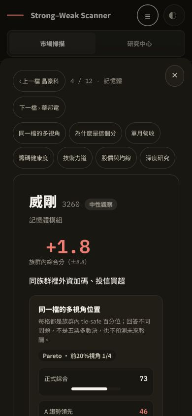
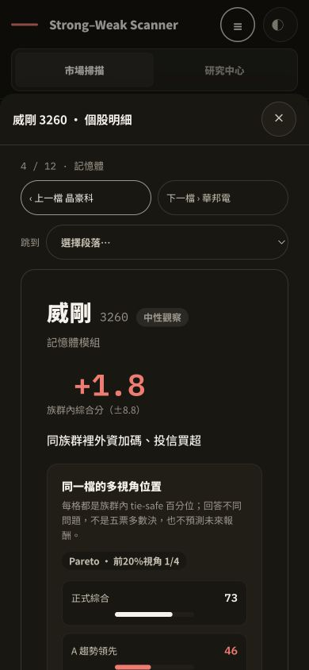
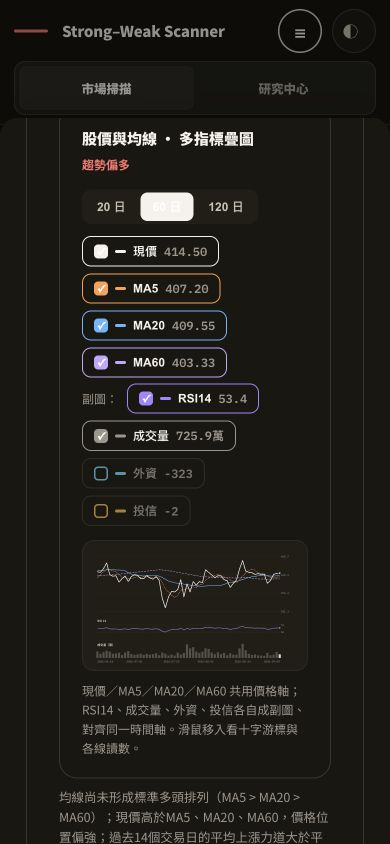
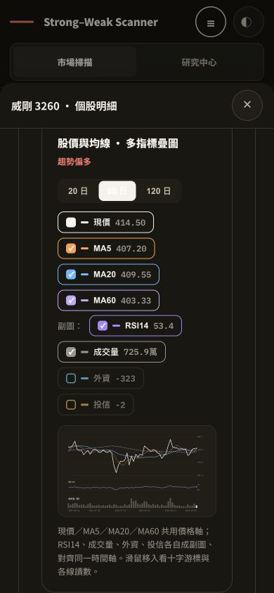
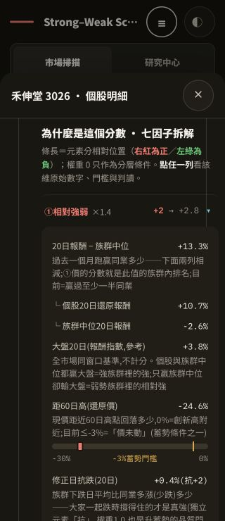
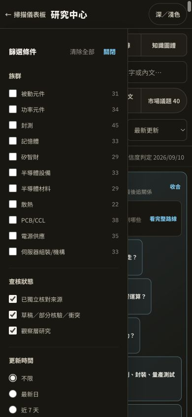
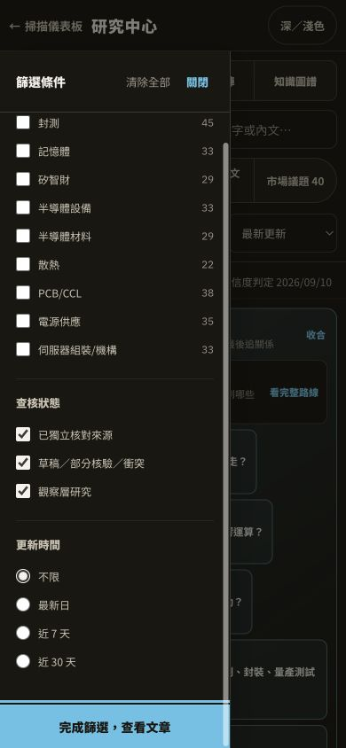
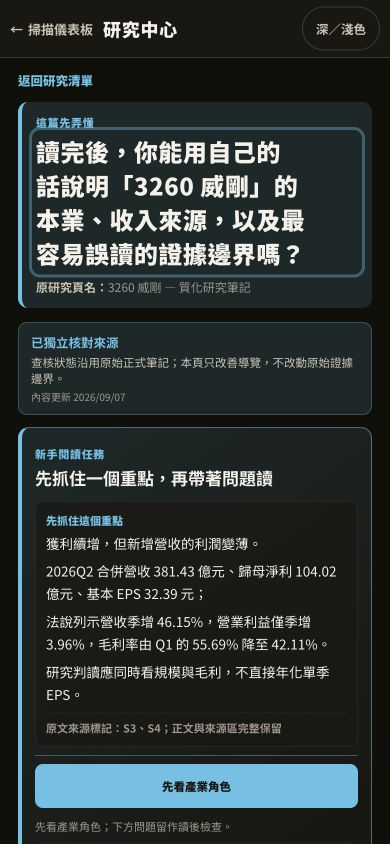
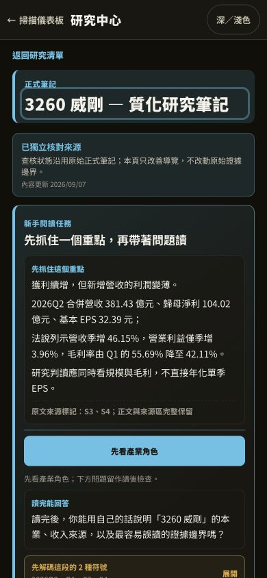
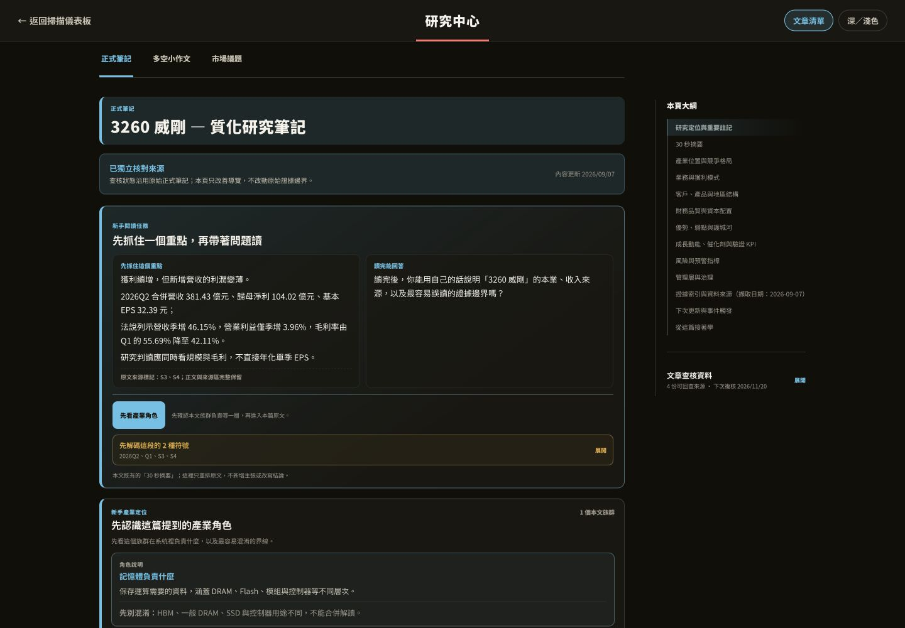

# 服務與閱讀體驗續查 — 2026-09-10

本輪接續 [第一輪審查](service_ux_review_2026-09-10.md)，從個股明細、手機研究篩選與公司研究長文確認三項 P2 問題。已依操作阻礙到閱讀層次的順序修正，每項驗證後獨立 commit 並 push 至 main。

| 步驟 | 檢查流程與結果 | 修正 commit |
| --- | --- | --- |
| 1 | 個股明細 → 跳到下方段落 → 關閉／切換個股：已修正並驗證 | `7f33d96` |
| 2 | 手機研究篩選 → 鍵盤操作 → 查看結果：已修正並驗證 | `89728e5` |
| 3 | 公司研究長文 → 確認公司與文類 → 開始閱讀：已修正並驗證 | `a3a289d` |

## 1. 個股明細：閱讀下方內容仍能直接關閉

原本七個跳段按鈕佔據手機首屏，名稱以七字硬截；往下閱讀時，關閉按鈕也會捲出畫面。既有明細、鍵盤 Escape 與來源焦點回復運作正常，保留這些行為。

修正後以固定標題列顯示公司／族群與關閉按鈕；手機使用完整段落名稱選單，上一／下一檔並排。跳段時避開固定列並將焦點送到目標標題；偏好減少動態時使用立即捲動。

390×844，深色，同一檔威剛首屏：

| 修正前 | 修正後 |
| --- | --- |
|  |  |

跳到股價與均線後，現在仍看得到個股名稱與關閉控制：

| 修正前 | 修正後 |
| --- | --- |
|  |  |

驗證：51 項 dashboard 測試通過；瀏覽器確認跳段、關閉後回到來源個股列、威剛→華邦電→威剛、第一檔的上一檔停用。320px 因子拆解仍能閱讀，抽屜 clientWidth 與 scrollWidth 都是 320px；390px 深淺主題均檢查過。

## 2. 研究篩選：完成操作後回到結果

原本面板有關閉與 Escape，但面板開啟時 Tab 可進入背後清單，背景仍可捲動；視覺上也缺少區隔。實測從「不限」radio 按 Tab，焦點移到被遮住的「研究文章」tab。

修正後面板帶有 dialog 語意、遮罩與背景 inert，開啟期間鎖定背景捲動。Tab 與 Shift+Tab 在面板內循環，radio 群組只納入目前已選選項。固定關閉列與底部「完成篩選，查看文章」讓操作出口持續可見。

| 原本手機面板 | 完成後：有遮罩、固定關閉與完成入口 |
| --- | --- |
|  |  |

右圖是鍵盤移至完成按鈕後的面板捲動位置。驗證：256 項研究相關測試通過；實測正反 Tab、完成按鈕、Escape、點遮罩，以及 390↔1440px 切換。完成後保留記憶體篩選的 33 篇結果、解除背景鎖定並還原焦點。新增 Node 行為測試檢查 radio 群組的 Tab 順序。

## 3. 公司研究長文：先辨識公司與文章類型

正式筆記與小作文原先把通用讀後問句作為大標題，下方閱讀任務又重複相同問句。以威剛正式筆記的手機首屏為例，大問句佔五行，公司與文類反而退到小字。

現在直接以原研究頁名為主標題，完整問句留在閱讀任務中；市場議題仍以具體研究問題作為主標題。查核狀態、主張、數字、來源、閱讀任務與角色跳轉均保留。

| 修正前 | 修正後 |
| --- | --- |
|  |  |

驗證：257 項研究相關測試通過；新增正式筆記、小作文、市場議題、無問句頁面的標題行為測試。瀏覽器確認 320px 小作文、390px 正式筆記、1440px 桌機閱讀與「先看產業角色」的焦點跳轉。

## 整合驗證與範圍

- 基準：`57fec56aa2a451f92a5e0a98e7a5501d53b1c9f3`；功能驗證版本：`a3a289dc5290c51bcd7806884172f6e69e197d4c`。
- 執行 `python scripts/prepublish_check.py --baseline-ref 57fec56aa2a451f92a5e0a98e7a5501d53b1c9f3 --output-dir tmp/round2-final-verification`：所有 lint、append-only 歷史檢查、685 項測試與隔離頁面生成通過，`protected_unchanged=true`。
- 執行環境：macOS 26.6.2 arm64，Python 3.11.11，UTF-8 mode 0，未設定 PYTHONUTF8，stdout UTF-8；Node 22.14.0。測試 13.173 秒，無 skip。這是測試全集的執行結果，非抽樣統計，SE／t 不適用。
- [GitHub tests](https://github.com/DennisLiuCk/strong-weak-scanner/actions/runs/34395637330) 成功；[Pages 發布](https://github.com/DennisLiuCk/strong-weak-scanner/actions/runs/34395636126) 成功，API 已確認 built commit 與功能版本相同。
- 第三項起使用隔離 worktree，避免與同目錄另一項研究工作混入未完成內容。基準之後的 `1eb8b05` 是另一項研究方法提交，非本次 UI 修正；本次沒有更改研究主張、策略、正式 DB 或歷史快照。
- 圖片均為本輪實際瀏覽器截圖，保存後逐張檢查；沒有以舊圖、模擬圖替代。檢查涵蓋本輪列出的操作與視口，未執行完整螢幕閱讀器認證，不能據此宣稱全站 WCAG 合規。
