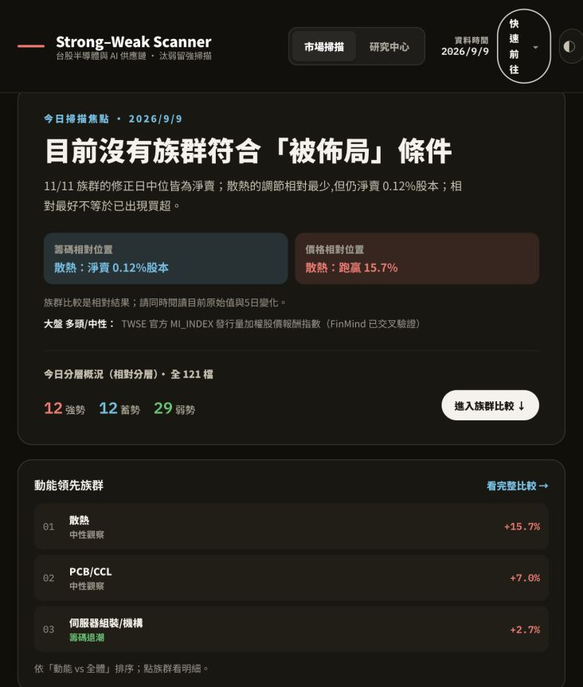
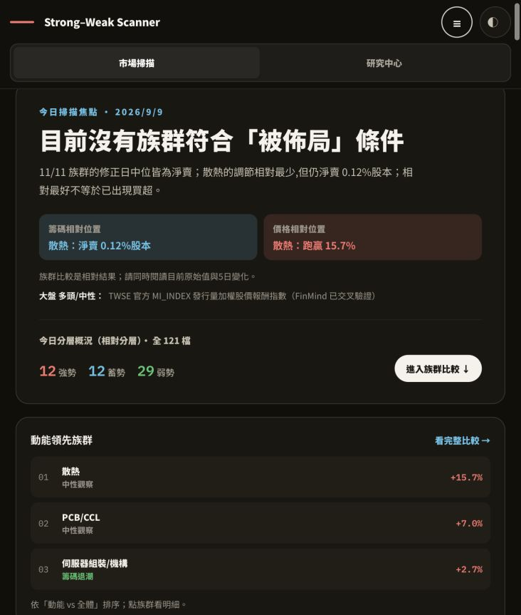
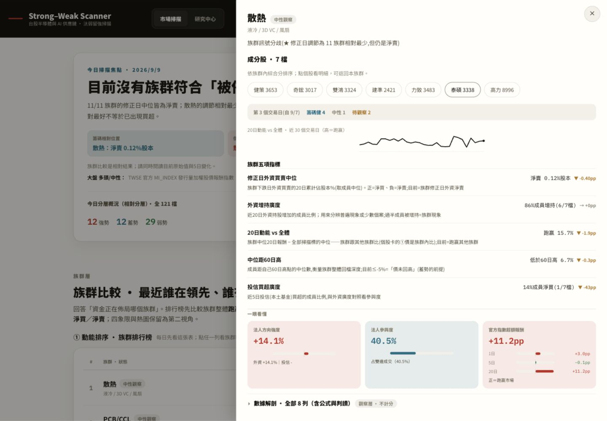
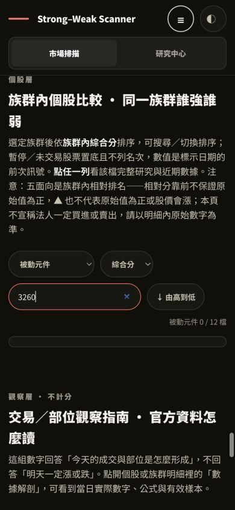
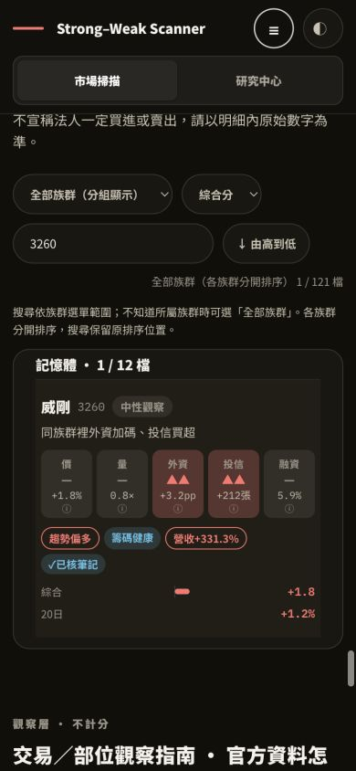
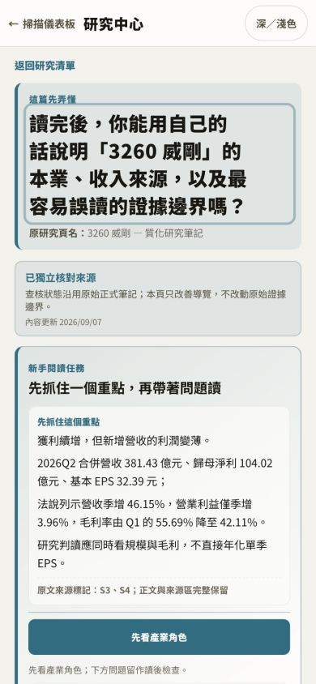
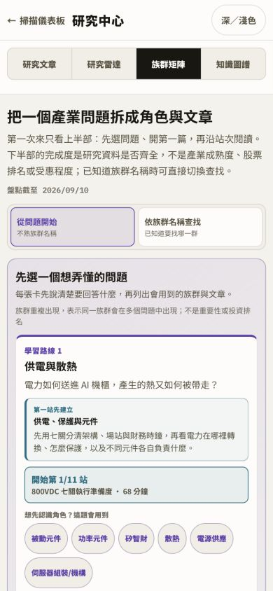
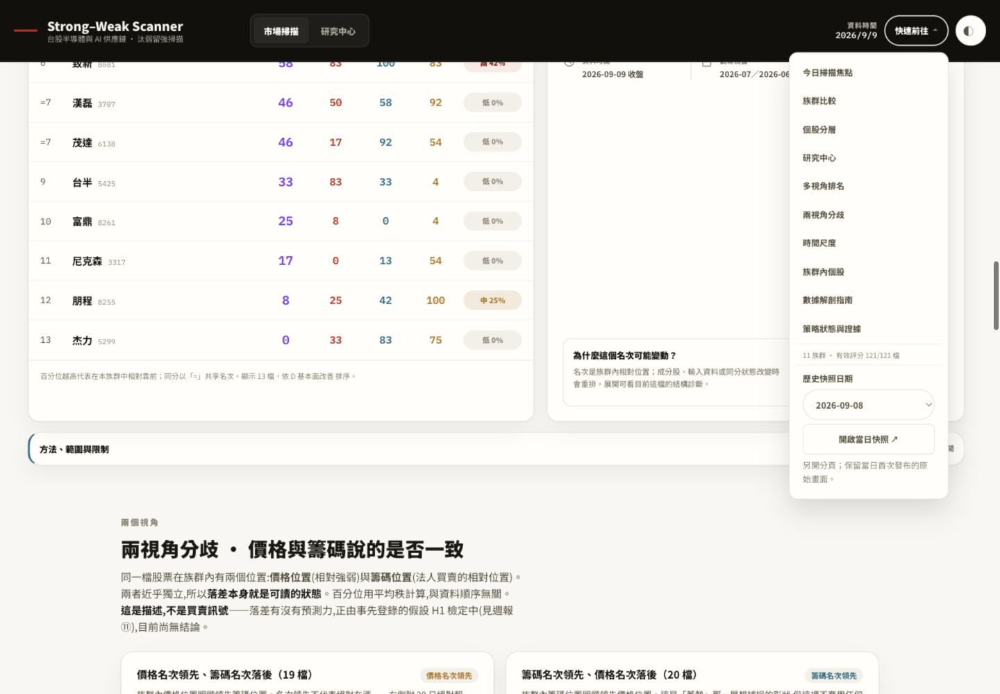

# 服務與 UI/UX 審查 — 2026-09-10

本輪從正式站與最新 main 開始，走查每日掃描、族群與個股明細、搜尋、研究閱讀、
雷達／矩陣／圖譜、歷史回看，並檢查資料稽核、發布閘門與 Actions。七項已確認問題
均完成修正、驗證及獨立 commit + push。保留既有視覺系統，優先處理載入中斷與操作阻礙。

起始基準：`037f7dddf8fd561969be2fb19302e10696470cce`；功能驗收版本：
`0c1bbf3f354c5165c24a2df8cea33d1831c56f0e`。

該功能版本的 [完整 tests](https://github.com/DennisLiuCk/strong-weak-scanner/actions/runs/34393122474)、
[研究品質 CI](https://github.com/DennisLiuCk/strong-weak-scanner/actions/runs/34393122431) 與
[Pages 部署](https://github.com/DennisLiuCk/strong-weak-scanner/actions/runs/34393121634) 均成功；
Pages latest build 回傳 built 與同一 SHA。正式站實點跨族群搜尋 3260→威剛明細成功。

## 問題優先序與修正

| 優先 | 已確認問題 | 修正與驗證 | 獨立 commit |
|---|---|---|---|
| P1 | localStorage 讀取遭拒會中斷兩個頁面的掛載 | 偏好讀寫容錯；執行 getter 拒絕、寫入額度錯誤、正常儲存三種情境；sandbox iframe 驗證首頁與研究搜尋 | `5d13eaa` |
| P2 | 在預設被動族群搜尋 3260 只剩空表 | 範圍說明、全部族群分組、跨族群命中入口、清除搜尋與 live region；保留原排序位置 | `66c999c` |
| P2 | 732px 導覽文字直排、主題按鈕超出右緣 | 導覽分列斷點提高至 900px；320／732／1440px 頁面無水平溢出，操作控制項可見 | `a5d4762` |
| P2 | 族群明細無法前往成分股，分歧名單無點擊入口 | 族群→個股→返回、同群上一／下一檔與 Enter／Escape 操作；關閉回復啟動焦點 | `5d1b4c1` |
| P2 | Pages 查詢逾時／缺 CLI 會丟棄本機健康報告 | 保留本機結果，Pages 列未確認與原因；僅 built 且同 HEAD 判完整 | `dcf876c` |
| P2 | README 有歷史選單說明，頁面卻無入口 | 快速前往恢復日期選擇，另開既有快照；實點確認 9/8 資料日期 | `768bfb6` |
| P2 | 已過期的 8/16 仍標為下次總檢查 | 依台北日期區分已到期／今日到期／未來／未設定；原期限不變 | `0c1bbf3` |

## 逐步走查與畫面證據

所有畫面均為本輪 Codex in-app browser 實際截圖，已開啟檢查；無法正確呈現 iframe
的空白截圖已排除。首次正式站觀察後，修正驗證使用本機相同資料的生成頁。

### 1. 服務健康與發布 — 通過，保留研究降級

正式資料日為 2026-09-09。全期原始資料稽核涵蓋 current universe 121 檔、
2026-03-02 至 2026-09-09 的 133 個交易日；SQLite integrity、必填欄位、公式與
canonical 對帳通過。法人表 74 筆既有資料不在交易日 spine，仍保留警示。
這些是完整性計數，不是抽樣估計或策略績效，SE／t 不適用。

原始資料、正式訊號、五個排名視角與最新 TDCC 完整。研究健康仍有 31/39 篇活躍
議題證據過期；這是需要取得新來源的研究維護工作，介面修復不會刷新其證據時鐘。

### 2. 首頁導覽與平板排版 — 已修正

732px 同尺寸前後畫面：原本右側控制項超出邊界，快速前往文字直排；修正後採兩列導覽。
保留明確資料日期、相對／絕對數值界線與原有深淺色。

### 3. 族群→個股→返回 — 已修正

散熱面板可直接選雙鴻，個股面板有返回來源族群按鈕。實測 Enter 開啟、返回族群、
Escape 關閉後焦點回到原散熱入口；分歧列也能用鍵盤開啟緯穎。背景維持 inert。

### 4. 個股搜尋與空結果 — 已修正

390×844 手機：預設族群內搜尋 3260 原本只有空白表。現在顯示原因與跨族群命中入口，
切換後以「記憶體」分組顯示威剛；不跨族群排序。另測前後空白、大小寫、找不到、
清除搜尋與暫停股票置底；搜尋保留完整族群的原排序位置。

### 5. 研究搜尋與全文閱讀 — 通過，儲存容錯已修正

研究搜尋 3260、formal-3260 深連結、全文閱讀與返回研究清單均可操作。
來源標記、核對狀態及原文邊界保留。瀏覽器拒絕儲存時仍可搜尋與閱讀。

### 6. 雷達→矩陣→圖譜來源 — 通過，期限文字已修正

雷達保留原始檢查日並明示已到期；矩陣問題與族群路由可切換。
知識圖譜「示範讀一條證實關係」能展開 Panasonic 關係、來源主張、證據時鐘與一手來源連結，
仍明確區分產品角色、商業階段與財務歸因。未重新查核外部研究主張。

### 7. 歷史回看 — 已恢復

快速前往選擇 2026-09-08，點擊後另開 archive/2026-09-08.html，確認頁面顯示 9/8。
原頁保留，既有 archive 原始內容不變；新版快照另有返回最新掃描入口。

## 驗收環境與限制

- macOS 26.6.2 arm64、Python 3.11.11、Node 22.14.0；Python UTF-8 mode 0、stdout UTF-8，
  未設定 PYTHONUTF8／PYTHONIOENCODING。完整 683 項測試通過。
- `prepublish_check.py --baseline-ref 037f7dddf8fd561969be2fb19302e10696470cce`：
  正式筆記／假說／議題歷史／圖譜／雷達／方法歷史 lint、完整測試、隔離重建一致性均通過。
- 正式 DB、46 份既有 archive、notes、config、score.py、validate.py 相對起始基準無差異；
  DB 存取由 db_ro 強制唯讀。策略權重、IS_CUTOFF 與 OOS 不變。
- 截圖與 DOM 檢查包含 320、390、732、1440px，以及深／淺色、滑鼠和部分鍵盤路徑。
  未以實體手機、Windows cp950 或螢幕閱讀器實測，不宣稱完整 WCAG 合規。
- 本輪未改動來源抓取協定，未手動觸發正式每日管線。市場 API 暫停、GitHub 長時間故障等
  外部情境由既有測試與錯誤狀態處理覆蓋，無實際故障注入到正式服務。
